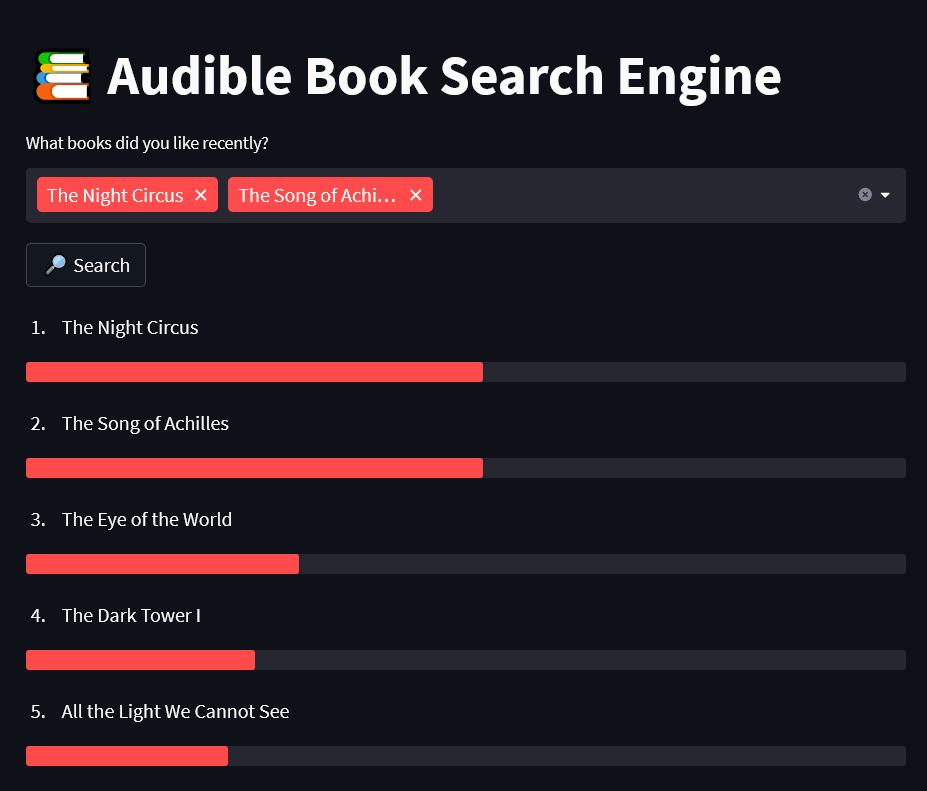

# 📖 Audiobook Search Engine

This project is about creating a neural search engine that allows to discover new audio-books based on title the user already likes.

## 🔎 Search Engine 

> Neural search engine is created using the [Jina](https://jina.ai/) framework.

## 🗂️ Data 

> The data used for this project are scrapped from [Audible](audible.com).

Data is scrapped using a Breadth First Search strategy: from a starting point (random audiobook), all recommended audibooks are enqueued and explored turn in turn.

## 📃 Embedding 

Embeddings are created using a link prediction model based on already existing Audible recommendations.

A recommendation graph of books is extracted from scrapping. A model is then trained to predict whenever two nodes of that graph are linked. During the training, embeddings are tuned and can finally be used during neural search.

The link prediction model using dot products in order to predict the existence of a link, embeddings are guided to be closer whenever two books should be recommended and farther when not.

A naive approach of averaging is used in order to allow multiple books to be selected as inputs.

> The link prediction model has been created using [PyG](https://pytorch-geometric.readthedocs.io/en/latest/).

## 💻 UI

A small demo UI is available in the project. It allows the user to select among available books, the ones he likes most and get the top *n* recommendations from the engines.

> The demo UI was created using [Streamlit](https://streamlit.io/).

